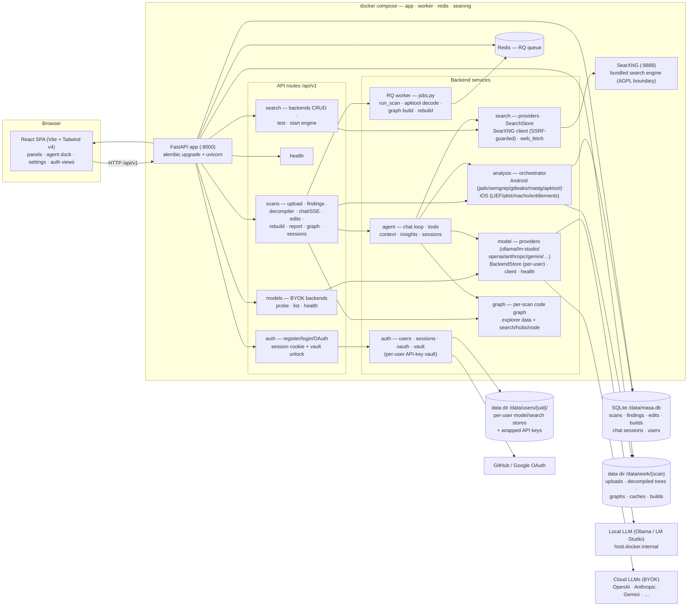

# MASA — Architecture

MASA (Mobile Application Security Assistant) is a self-hosted, local-first
dashboard for static analysis of Android (APK) and iOS (IPA) apps, with a
chat-with-decompiled-code agent. This document is the module-level map;
the interactive entity graph lives in `graphify-out/graph.html` (rebuild
with the graphify skill / `graphify update .`).

## Component diagram

## How the pieces fit

- **Single origin.** FastAPI serves the built SPA at `/` (with an SPA
  fallback) plus the `/api/v1` routes — no separate static server.
  Backend-only dev runs without `frontend/dist`; the root then returns a
  bare API banner.
- **Auth is the outer gate.** `health` and `auth` are the only open
  routers; every other `/api/v1` router depends on `get_current_user`
  (session cookie → user). `MASA_AUTH_ENABLED=0` restores the fully-open
  single-user mode (dev/CI parity). All scan-keyed routes resolve the owner
  from the request context (`request_ctx`), so isolation is structural.
- **Per-user stores + vault.** Model/search BYOK configs live in
  `data/users/<uid>/`; API keys are wrapped with a per-user master key
  derived from the login password. The agent loop receives `user_id` +
  `master_key` explicitly because it runs on a worker thread that does not
  inherit the request thread's contextvars.
- **Long work is async.** Scan analysis, apktool decode, code-graph
  builds, and rebuilds are RQ jobs enqueued by the API and run by the
  worker over Redis — both services share the SQLite DB and data dir.
- **Agent = local-first, tool-using chat.** The chat loop layers: findings
  context (Layer 1), code/file tools (Layer 2), graph tools (Layer 3),
  edit/recompile tools, and opt-in web research (`web_search` /
  `web_fetch` through the bundled SearXNG — SSRF-guarded, AGPL boundary
  kept by talking HTTP JSON only). Streaming is SSE
  (`POST /scans/{id}/chat/stream`).
- **Analysis pipeline.** The orchestrator runs Android stages
  (manifest, jadx decompile, semgrep MASTG rules, gitleaks secrets,
  dependency inventory, apktool decode on demand) and iOS stages
  (unzip, Info.plist, Mach-O via LIEF, entitlement carving, symbol
  import scanning) into persisted `Finding` rows, then computes the
  CVSS 4.0 band-symmetric risk score.

## Key modules

| Area | Path | Responsibility |
|---|---|---|
| API routes | `backend/app/api/routes/` | `health` · `auth` · `scans` · `models` · `search` |
| Auth | `backend/app/auth/` | users, sessions (sliding cookies), GitHub/Google OAuth, password-derived key vault |
| Agent | `backend/app/agent/` | chat loop + SSE, tools, findings context, insights, chat sessions |
| Analysis | `backend/app/analysis/` | orchestrator, Android/iOS stages, edits, rebuild, report (+PDF), risk, dependency inventory |
| Model | `backend/app/model/` | providers, per-user BackendStore, client (litellm), health/probe, fake dev model |
| Search | `backend/app/search/` | providers, SearchStore (one-active radio), SearXNG client, web_fetch |
| Graph | `backend/app/graph/` | per-scan graphify build + explorer endpoints |
| Workers | `backend/app/workers/` | RQ jobs + Redis wiring |
| CLI | `backend/app/cli.py` | host operator commands (run/scan/jobs/graph/agent/auth reset) |
| Frontend | `frontend/src/` | React SPA: panels, agent dock, settings, auth views, code viewer |
| Compose | `docker-compose.yml` | app + worker + redis + searxng (always-on), shared `/data` volume |
