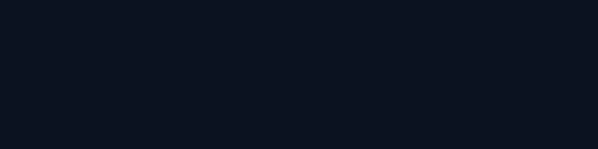
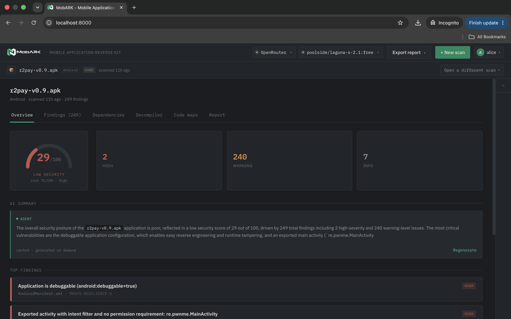

<p align="center">
  
</p>

<p align="center">
  <b>Self Hosted mobile application security testing</b>: static analysis + AI Agent for Android &amp; iOS.
</p>

<p align="center">
  <a href="https://github.com/suwasto/MobARK/blob/main/LICENSE"></a>
  <a href="https://www.python.org/downloads/"></a>
  <a href="https://nodejs.org/"></a>
  <a href="https://github.com/suwasto/MobARK/actions/workflows/backend.yml"></a>
  <a href="https://github.com/suwasto/MobARK/actions/workflows/frontend.yml"></a>
  <a href="https://hub.docker.com/r/suwasto/mobark"></a>
  <a href="https://suwasto.github.io/MobARK/"></a>
</p>

---

https://github.com/user-attachments/assets/69d2a0e3-8ee0-402d-95cb-9ccf065268ac

**MobARK** is a self-hosted dashboard for mobile application security
testing: Android (APK) and iOS (IPA). Upload a binary and MobARK
decompiles it, runs static analysis (jadx / apktool / semgrep / gitleaks
/ LIEF), scores findings with a plain severity-based risk index
(`high | warning | info`), and gives you an **AI Agent
that can chat with the decompiled code**: all through your own local
LLM (Ollama / LM Studio) with **nothing leaving your infrastructure by
default**.

## Features

- **Static analysis**: Android (manifests, jadx decompile, curated +
  OWASP MASTG semgrep rules, secrets scanning, dependency inventory) and
  iOS (Mach-O via LIEF, entitlements, Info.plist, insecure-import
  scanning)
- **AI Agent**: chat with the decompiled code (findings context +
  code search/read + per-scan code graph tools), live step/token
  streaming, **opt-in web research** through a bundled SearXNG
- **Edit & recompile** (Android): apktool decode, smali edits,
  resigned test APK builds. iOS stays **read-only**: rebuilding an
  IPA requires an Apple Developer account and signing certificates,
  and edit support is very limited there.
- **Reports**: deterministic Markdown/PDF with banded risk-index
  scoring (`high | warning | info` severities), per-finding
  suppression, AI (or no-model) explanations
- **Multi-user auth**: username/password + GitHub/Google OAuth,
  per-user data isolation, encrypted per-user key vault
- **Self-hosted**: app, worker, Redis, and the search engine all run
  under `docker compose` on infrastructure you control

## Quick start (Docker)

> Requires Docker with the Compose v2 plugin. Prebuilt images are
> `linux/amd64` in v0.1.0 (the analysis toolchain is x86_64-only — see
> [RELEASING.md](RELEASING.md) before running on arm64 hosts).

### Install a release from Docker Hub

```bash
docker compose pull   # suwasto/mobark:0.1.0 + redis + searxng
docker compose up
```

Or pull the image directly: `docker pull suwasto/mobark:0.1.0`. To pin
another release, set `MOBARK_IMAGE_TAG=<version>` in `.env`.

### Try the image alone (`docker run`)

Just the app container — a quick look at the UI, auth, and settings
without the full stack. **Analysis does not run here**: scan uploads
are RQ jobs that need Redis + the worker, so use the compose stack
above for anything real.

```bash
docker run -d --name mobark \
  -p 8000:8000 \
  -v mobark-data:/data \
  -e MOBARK_DATABASE_URL=sqlite:////data/mobark.db \
  -e MOBARK_DATA_DIR=/data \
  suwasto/mobark:0.1.0
```

Open **http://localhost:8000** and register the first account (it
becomes the instance admin). The `mobark-data` volume keeps the SQLite
database and uploads across container recreates; drop `-v` for a
throwaway run. To reach an LLM running on the host, add
`-e MOBARK_OLLAMA_BASE_URL=http://host.docker.internal:11434` (plus
`--add-host host.docker.internal:host-gateway` on Linux). Clean up with
`docker rm -f mobark`.

### Build from source (dev)

```bash
docker compose up --build
```

Either way, open **http://localhost:8000**. Auth is on by default: a
fresh install lands on the register/login screen. There are no seeded
accounts: the **first account you register becomes the instance
admin**, and every later account is a regular user who only sees their
own scans. The first account also automatically **claims any unowned
scans** (data scanned while auth was off, or via the CLI without
`--user`), so that history lands on the admin's dashboard.

For example, to try it as the admin, register a first account with the
username of your choice (e.g. `admin`) and **a password you pick
yourself**: the `password123` shown in these docs is only an example,
not a default or seeded credential.

> **Warning:** never expose an install with example passwords to a
> network: use real, unique passwords on any install that faces one.

To skip auth entirely (dev/CI): set `MOBARK_AUTH_ENABLED=0` in `.env`.

See [Quickstart](https://suwasto.github.io/MobARK/quickstart/) for local
development setup and the full configuration reference, and
[`RELEASING.md`](RELEASING.md) for how releases get to Docker Hub.

## Architecture

MobARK is one `docker compose` stack: a FastAPI backend, an RQ worker,
Redis (the job queue), and a bundled SearXNG search engine, all sharing
a SQLite database and a data dir. The React SPA is served from the same
FastAPI origin (no separate static server).

- **Auth is the outer gate.** Every `/api/v1` router (except `health` and
  `auth`) sits behind a session cookie; all scan-keyed routes resolve the
  owner from the request context, so per-user isolation is structural.
- **Per-user stores + vault.** Model/search BYOK configs live under
  `data/users/<uid>/`; API keys are encrypted at rest with a per-user
  master key derived from the login password.
- **Long work is async.** Scan analysis, apktool decode, code-graph
  builds, and rebuilds are RQ jobs shared between the API and the worker
  over Redis.
- **Agent = tool-using chat.** The chat loop layers findings
  context, file tools, graph tools, and edit/recompile tools, with
  opt-in web research through the bundled SearXNG (SSRF-guarded, HTTP
  JSON only). Streaming is SSE.

See [`ARCHITECTURE.md`](ARCHITECTURE.md) for the module map and the
full component diagram.

## Documentation

- **Full docs site:** https://suwasto.github.io/MobARK/ (source:
  [`site/`](site/), MkDocs + Material)
- **Architecture:** [`ARCHITECTURE.md`](ARCHITECTURE.md)
- **Dependency licenses:** third-party attribution lives in
  [`site/docs/licenses.md`](site/docs/licenses.md) (rendered on the
  [licenses page](https://suwasto.github.io/MobARK/licenses/))
- **Contributing:** [`CONTRIBUTING.md`](CONTRIBUTING.md)
- **Security:** [`SECURITY.md`](SECURITY.md)

## Screenshots

<p align="center">
  
</p>

<p align="center">
  
</p>

<p align="center">
  
</p>

## Project status

**Shipped:**

- **Static analysis**: Android (manifest, jadx decompile, curated +
  vendored MASTG semgrep rules, secrets, dependency inventory) and
  iOS (Mach-O via LIEF, entitlements, Info.plist, insecure-import
  scanning)
- **AI Agent**: chat with the decompiled code via a local LLM, with
  live tool/token streaming and opt-in web research
- **Edit & recompile** (Android): apktool decode, smali edits,
  resigned test APK builds. iOS stays **read-only**: rebuilding an
  IPA requires an Apple Developer account and signing certificates,
  and edit support is very limited there.
- **Reports**: deterministic Markdown/PDF with banded risk-index
  scoring, per-finding suppression, AI (or no-model) explanations
- **Multi-user auth**: username/password + GitHub/Google OAuth,
  per-user data isolation, encrypted per-user key vault

**Future plans:** dynamic analysis (runtime/device testing) is next on
 the roadmap: see [`CHANGELOG.md`](CHANGELOG.md) for the full history.

## License

Apache-2.0: see [`LICENSE`](LICENSE). GPL/LGPL tools in the stack
(Semgrep, SearXNG) run subprocess-only / as separate containers; every
imported library is permissive. See the
[license audit](site/docs/licenses.md) and the
[site licenses page](https://suwasto.github.io/MobARK/licenses/).
