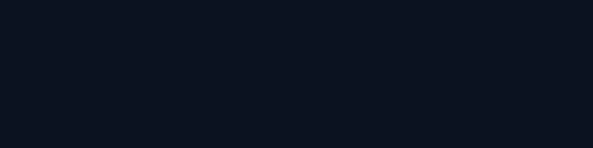

<p align="center">
  
</p>

<p align="center">
  <b>Local-first mobile application security testing</b> — static analysis + AI copilot for Android &amp; iOS,
  no scan data leaves your machine.
</p>

<p align="center">
  <a href="https://github.com/suwasto/masa/blob/main/LICENSE"></a>
  <a href="https://www.python.org/downloads/"></a>
  <a href="https://nodejs.org/"></a>
  <a href="https://github.com/suwasto/masa/actions/workflows/backend.yml"></a>
  <a href="https://github.com/suwasto/masa/actions/workflows/frontend.yml"></a>
  <a href="https://suwasto.github.io/masa/"></a>
</p>

---

**MASA** is a self-hosted dashboard for mobile application security
testing — Android (APK) and iOS (IPA). Upload a binary and MASA
decompiles it, runs static analysis (jadx / apktool / semgrep / gitleaks
/ LIEF), scores findings with a plain severity-based risk index
(`high | warning | info` — deliberately not CVSS, which needs a human
analyst for disclosed CVEs), and gives you an **AI copilot
that can chat with the decompiled code** — all through your own local
LLM (Ollama / LM Studio) with **nothing leaving your machine by
default**.

## Features

- **Static analysis** — Android (manifests, jadx decompile, curated +
  OWASP MASTG semgrep rules, secrets scanning, dependency inventory) and
  iOS (Mach-O via LIEF, entitlements, Info.plist, insecure-import
  scanning)
- **AI copilot** — chat with the decompiled code (findings context +
  code search/read + per-scan code graph tools), live step/token
  streaming, **opt-in web research** through a bundled SearXNG
- **Edit & recompile** (Android) — apktool decode, smali edits,
  resigned test APK builds
- **Reports** — deterministic Markdown/PDF with banded risk-index
  scoring (`high | warning | info` severities, no CVSS claim),
  per-finding suppression, AI (or no-model) explanations
- **Multi-user auth** — username/password + GitHub/Google OAuth,
  per-user data isolation, encrypted per-user key vault
- **Local-first** — app, worker, Redis, and the search engine all run
  locally under `docker compose`

## Quick start (Docker)

> Requires Docker with the Compose v2 plugin.

```bash
docker compose up --build
```

Open **http://localhost:8000**. Auth is on by default: a fresh install
lands on the register/login screen and the **first registered account
becomes the admin**.

For a quick local evaluation, register these two demo accounts:

| Username | Password | Role |
|---|---|---|
| `admin` | `password123` | Admin — register first |
| `alice` | `password123` | Regular user — sees only her own scans |

> **Warning:** demo credentials are for local installs only — never
> expose an install with known passwords to a network.

To skip auth entirely (dev/CI): set `MASA_AUTH_ENABLED=0` in `.env`.

See [Quickstart](https://suwasto.github.io/masa/quickstart/) for local
development setup and the full configuration reference.

## Documentation

- **Full docs site:** https://suwasto.github.io/masa/ (source:
  [`site/`](site/), MkDocs + Material)
- **Architecture:** [`ARCHITECTURE.md`](ARCHITECTURE.md)
- **Dependency licenses:** [`docs/licenses.md`](docs/licenses.md) —
  third-party attribution in a separate file (summary on the
  [licenses page](https://suwasto.github.io/masa/licenses/))
- **Contributing:** [`CONTRIBUTING.md`](CONTRIBUTING.md)
- **Security:** [`SECURITY.md`](SECURITY.md)

## Screenshots

> **OWNER: add.** Placeholders — replace with captures of a real scan.

<p align="center">
  
</p>

<p align="center">
  
</p>

<p align="center">
  
</p>

## Project status

Milestone-driven development: **M0–M9.1 shipped** (analysis, agent,
edit/recompile, reports, auth + per-user isolation) and **M10
(open-source readiness)** in progress — see
[`CHANGELOG.md`](CHANGELOG.md) for the history.

## License

Apache-2.0 — see [`LICENSE`](LICENSE). GPL/LGPL tools in the stack
(Semgrep, SearXNG) run subprocess-only / as separate containers; every
imported library is permissive. See the
[license audit](docs/licenses.md) and the
[site licenses page](https://suwasto.github.io/masa/licenses/).
