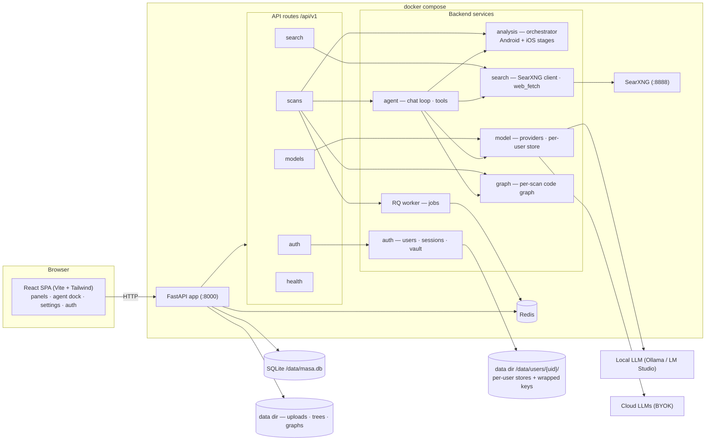

# Architecture

MASA is a compose stack — `app` (FastAPI) + `worker` (RQ) + `redis` +
`searxng` — sharing a SQLite database and a data dir. The React SPA is
served from the same FastAPI origin.

## Design notes

- **Single origin.** FastAPI serves the built SPA at `/` (with an SPA
  fallback) plus `/api/v1` — no separate static server.
- **Auth is the outer gate.** `health` + `auth` are the only open
  routers; every other router depends on `get_current_user`. All
  scan-keyed routes resolve the owner from the request context, so
  per-user isolation is structural. `MASA_AUTH_ENABLED=0` restores the
  fully-open single-user mode.
- **Per-user stores + vault.** Model/search BYOK configs live under
  `data/users/<uid>/`; keys are wrapped with a per-user master key
  derived from the login password. The agent loop receives `user_id` +
  `master_key` explicitly because it runs on a worker thread that does
  not inherit the request thread's contextvars.
- **Long work is async.** Scan analysis, apktool decode, code-graph
  builds, and rebuilds are RQ jobs shared between the API and worker
  over Redis.
- **Agent = local-first, tool-using chat.** Findings context (L1), file
  tools (L2), graph tools (L3), edit/recompile tools, and opt-in
  web research through the bundled SearXNG (SSRF-guarded, HTTP-JSON
  only — the AGPL boundary). Streaming is SSE.
- **Analysis pipeline.** Android stages (manifest, jadx, semgrep MASTG
  rules, gitleaks, dependency inventory, apktool decode) and iOS stages
  (unzip, Info.plist, Mach-O via LIEF, entitlement carving, symbol
  scanning) persist `Finding` rows, then compute a plain severity-based
  risk index (`high | warning | info` — deliberately not CVSS, which
  requires a human analyst for disclosed CVEs).

## Key modules

| Area | Path | Responsibility |
|---|---|---|
| API routes | `backend/app/api/routes/` | health · auth · scans · models · search |
| Auth | `backend/app/auth/` | users, sessions, OAuth, key vault |
| Agent | `backend/app/agent/` | chat loop + SSE, tools, context, insights, sessions |
| Analysis | `backend/app/analysis/` | orchestrator, Android/iOS stages, edits, rebuild, report, risk |
| Model | `backend/app/model/` | providers, per-user store, client, health |
| Search | `backend/app/search/` | providers, store, SearXNG client, web_fetch |
| Graph | `backend/app/graph/` | per-scan code graph + explorer endpoints |
| Workers | `backend/app/workers/` | RQ jobs |
| CLI | `backend/app/cli.py` | host operator commands |
| Frontend | `frontend/src/` | React SPA |

The interactive entity graph (module/function level, ~3.7k nodes) is
generated by the graphify skill into `graphify-out/graph.html` — run
`/graphify` in the repo to (re)build it.
