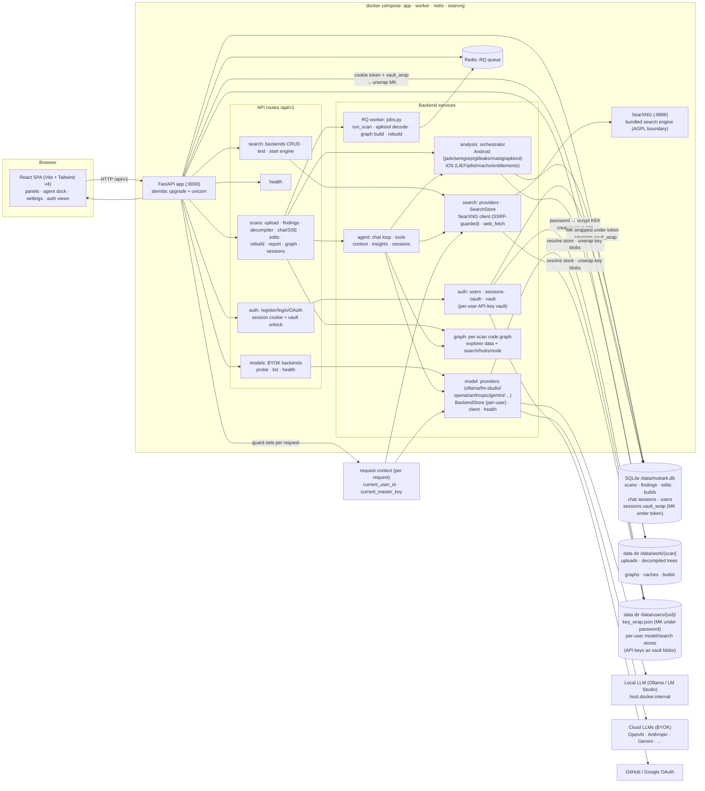

# Architecture

MobARK (Mobile Application Reverse Kit) is a self-hosted dashboard for
static analysis of Android (APK) and iOS (IPA) apps, with a
chat-with-decompiled-code agent. This page is the module-level map,
kept in sync with [`ARCHITECTURE.md`](https://github.com/suwasto/MobARK/blob/main/ARCHITECTURE.md);
the interactive entity graph lives in `graphify-out/graph.html` (rebuild
with the graphify skill / `graphify update .`).

## Project structure

```text
.
├── docker-compose.yml          # app + worker + redis + searxng (always-on)
├── backend/                    # FastAPI app + RQ worker (Python 3.11)
│   ├── app/
│   │   ├── api/routes/         # /api/v1 routers (health · auth · scans · models · search)
│   │   ├── agent/              # chat loop + SSE · tools · insights · chat sessions
│   │   ├── analysis/           # orchestrator · Android/iOS stages · edits · rebuild · report/PDF
│   │   ├── auth/               # users · sessions · OAuth · per-user key vault
│   │   ├── graph/              # per-scan code graph (graphify)
│   │   ├── model/              # LLM providers · per-user BackendStore · client · health
│   │   ├── search/             # search providers · SearchStore · SearXNG client · web_fetch
│   │   ├── workers/            # RQ jobs (run_scan · decode · graph · rebuild)
│   │   ├── cli.py              # host operator CLI (scan/jobs/graph/agent/auth)
│   │   ├── config.py           # env-driven settings (MOBARK_* prefix)
│   │   ├── db.py               # SQLAlchemy engine + session
│   │   └── main.py             # FastAPI app + SPA serving
│   ├── alembic/                # schema migrations
│   ├── tests/                  # pytest suite (unit; integration marked)
│   └── worker.py               # RQ worker entrypoint
├── frontend/                   # React SPA (Vite + Tailwind v4, TypeScript)
│   └── src/
│       ├── components/         # panels · agent dock · settings · auth views · code viewer
│       ├── api/                # typed API client (REST + SSE)
│       ├── hooks/              # chat · upload · settings · resize/persistence
│       ├── lib/                # sse · markdown · formatting helpers
│       └── state/              # app context + localStorage persistence
├── docker/                     # Dockerfile.app · bundled SearXNG settings
├── scripts/                    # e2e gates · asset sync (wordmark · social preview)
├── site/                       # public MkDocs docs (site/docs) + assets
└── .github/                    # CI workflows · issue templates · dependabot
```

Runtime state that stays out of git: `data/` (uploads, per-user stores,
vaults, SQLite), `docs/` (internal milestone notes, gitignored) and
`graphify-out/` (generated code graphs).

## Component diagram



## How the pieces fit

- **Single origin.** FastAPI serves the built SPA at `/` (with an SPA
  fallback) plus the `/api/v1` routes: no separate static server.
  Backend-only dev runs without `frontend/dist`; the root then returns a
  bare API banner.
- **Auth is the outer gate.** `health` and `auth` are the only open
  routers; every other `/api/v1` router depends on `get_current_user`
  (session cookie → user). `MOBARK_AUTH_ENABLED=0` restores the fully-open
  single-user mode (dev/CI parity). All scan-keyed routes resolve the owner
  from the request context (`request_ctx`), so isolation is structural.
- **Per-user stores + vault.** Model/search BYOK configs live in
  `data/users/<uid>/`; API keys are stored there as AES-GCM vault blobs
  under a per-user master key (MK) that never touches disk in plaintext.
  The MK is wrapped under the login password (scrypt KEK) in
  `key_wrap.json` at register/login, then re-wrapped under the raw session
  token into `sessions.vault_wrap`; every guarded request unwraps it from
  the cookie + session row into the request context (`current_user_id`,
  `current_master_key`), which the store factories read to decrypt keys at
  use. OAuth-only accounts (no password) unlock the same vault with a
  dedicated passphrase per session. The agent loop receives `user_id` +
  `master_key` explicitly because it runs on a worker thread that does not
  inherit the request thread's contextvars.
- **Long work is async.** Scan analysis, apktool decode, code-graph
  builds, and rebuilds are RQ jobs enqueued by the API and run by the
  worker over Redis: both services share the SQLite DB and data dir.
- **Agent = tool-using chat.** The chat loop layers: findings
  context (Layer 1), code/file tools (Layer 2), graph tools (Layer 3),
  edit/recompile tools, and opt-in web research (`web_search` /
  `web_fetch` through the bundled SearXNG: SSRF-guarded, AGPL boundary
  kept by talking HTTP JSON only). Streaming is SSE
  (`POST /scans/{id}/chat/stream`).
- **Analysis pipeline.** The orchestrator runs Android stages
  (manifest, jadx decompile, semgrep MASTG rules, gitleaks secrets,
  dependency inventory, apktool decode on demand) and iOS stages
  (unzip, Info.plist, Mach-O via LIEF, entitlement carving, symbol
  import scanning) into persisted `Finding` rows, then computes the
  banded risk index (high | warning | info, deliberately not CVSS).

## Key modules

| Area | Path | Responsibility |
|---|---|---|
| API routes | `backend/app/api/routes/` | `health` · `auth` · `scans` · `models` · `search` |
| Auth | `backend/app/auth/` | users, sessions (sliding cookies), GitHub/Google OAuth, password-derived key vault |
| Agent | `backend/app/agent/` | chat loop + SSE, tools, findings context, insights, chat sessions |
| Analysis | `backend/app/analysis/` | orchestrator, Android/iOS stages, edits, rebuild, report (+PDF), risk, dependency inventory |
| Model | `backend/app/model/` | providers, per-user BackendStore, client (litellm), health/probe, fake dev model |
| Search | `backend/app/search/` | providers, SearchStore (one-active radio), SearXNG client, web_fetch |
| Graph | `backend/app/graph/` | per-scan graphify build + explorer endpoints |
| Workers | `backend/app/workers/` | RQ jobs + Redis wiring |
| CLI | `backend/app/cli.py` | host operator commands (run/scan/jobs/graph/agent/auth reset) |
| Frontend | `frontend/src/` | React SPA: panels, agent dock, settings, auth views, code viewer |
| Compose | `docker-compose.yml` | app + worker + redis + searxng (always-on), shared `/data` volume |

The interactive entity graph (module/function level, ~3.7k nodes) is
generated by the graphify skill into `graphify-out/graph.html`: run
`/graphify` in the repo to (re)build it.
