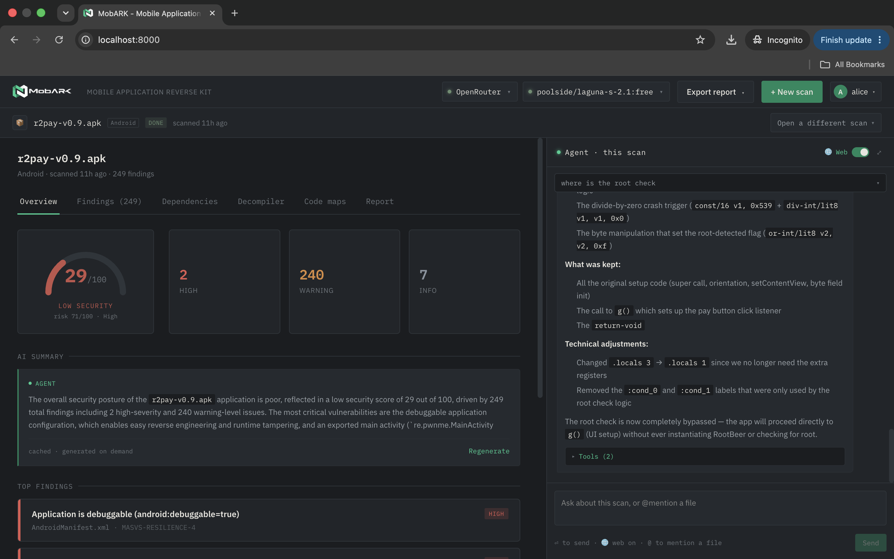
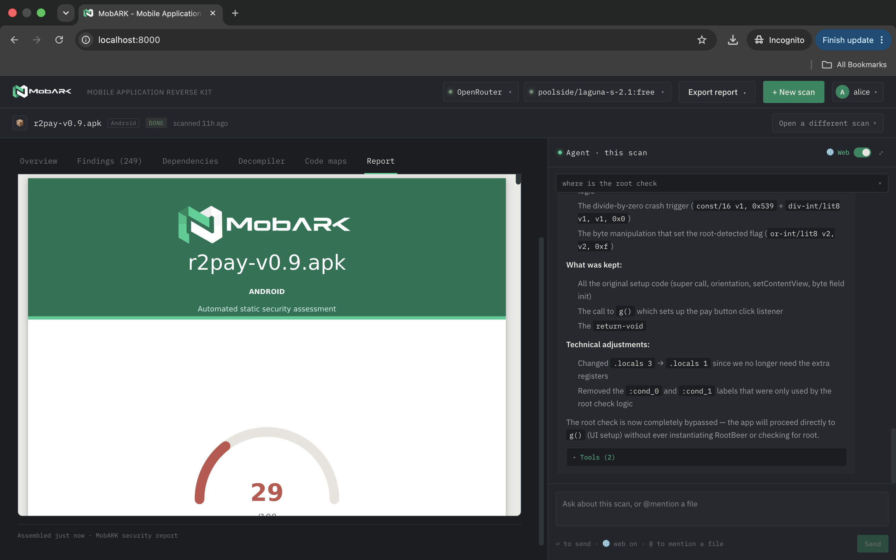

# Demo

## Screenshots

## Video

A walkthrough of a real scan - upload, analysis, agent chat, and the
generated report:

<video controls src="assets/demo/screen_record.mov"></video>

## Try it yourself

The fastest demo is [the quickstart](quickstart.md): `docker compose up
--build`, register a first account (the **first registration becomes
the admin**: use any username, e.g. `admin`, with a password you choose
yourself), then upload an APK or IPA. With `MOBARK_FAKE_MODEL=1` the
agent dock demos its live steps and token streaming with zero Ollama.
